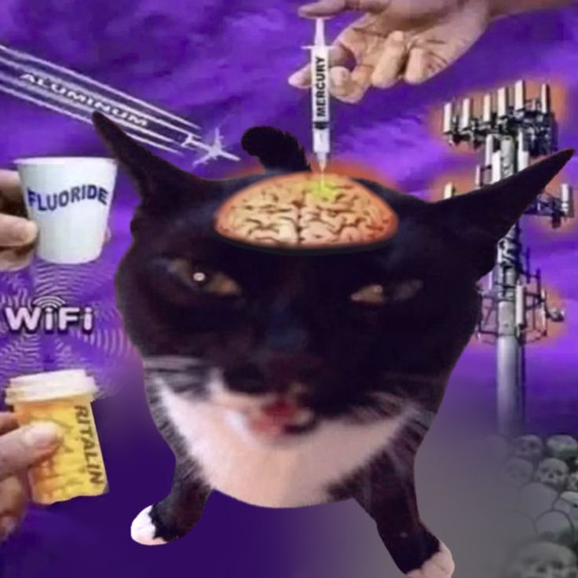

## Security@FIT

Jakub Reš, Petr Kaška, Matej Olexa, Kamil Malinka

## Brain Surgery of LLMs: ROME

- ROME edits factual associations in a model via direct weight updates.
- The goal is to change a specific memory while preserving general behavior.
- It is often presented as a targeted model-editing method.

## Can we detect ROME?

{fig-alt="Illustration related to ROME detection" width="70%"}

- Potential signals: activation drift, layer-wise anomalies, and changed fact probes.
- Practical detection depends on access level and baseline comparisons.

## Jailbreaks

- Jailbreaks attempt to bypass a model's safety constraints through crafted prompts.
- Defenses include stronger instruction hierarchy, filtering, and monitoring.
- Evaluation should include adaptive red teaming, not only static benchmarks.
